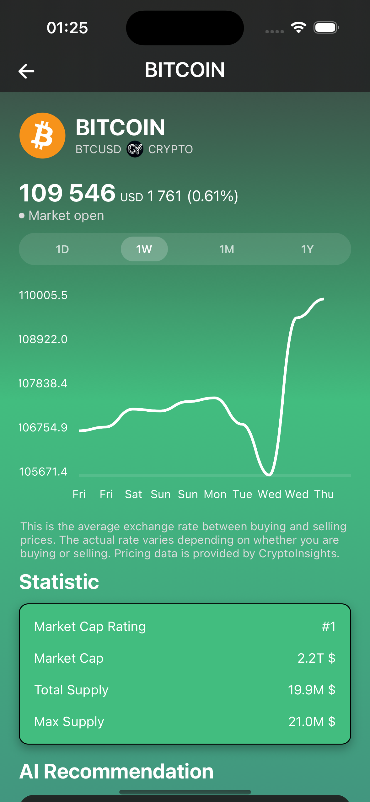

# CryptoAI Insights

## 📊 Overview

CryptoAI Insights is an advanced cryptocurrency analytics platform that leverages artificial intelligence to provide price predictions, sentiment analysis, and personalized trading recommendations. Our application combines cutting-edge machine learning models with comprehensive market data to help traders make more informed decisions.

## ✨ Key Features

- **AI-Powered Price Prediction**: Ensemble of LSTM, GRU, and Transformer models for accurate forecasting
- **Sentiment Analysis**: Real-time analysis of news, social media, and market sentiment
- **Portfolio Management**: Track, analyze, and optimize your cryptocurrency holdings
- **Personalized Recommendations**: Trading suggestions based on your risk profile and market conditions
- **Real-time Data**: Live updates on cryptocurrency prices, volumes, and market movements

## 🛠️ Tech Stack

### Frontend

- React Native with Atomic Design pattern
- Mobx for state management
- React Query for data fetching
- Styled Components for UI styling

### Backend

- Python (FastAPI/Django REST)
- Microservice architecture
- JWT authentication
- GraphQL and REST API interfaces

### Data & AI

- MongoDB for user data
- TimescaleDB for time series data
- Redis for caching
- TensorFlow/PyTorch for AI models
- NLP with BERT/RoBERTa for sentiment analysis

### Infrastructure

- Docker containers
- Kubernetes orchestration
- CI/CD through GitHub Actions
- ELK Stack for monitoring

## 📱 Application Screenshots


CryptoAI Insights mobile app showing the market heatmap and top gainers



CryptoAI Insights mobile app showing the coin information


CryptoAI Insights mobile app AI ChatBot


CryptoAI Insights mobile app AI analysis per a request

## 🎥 Demo Video


CryptoAI Insights mobile app Profile screen animation

## 🚀 Getting Started

### Prerequisites

- Node.js 16+
- Python 3.8+
- Docker and Docker Compose
- MongoDB
- Redis

### Installation

```bash
# Clone the repository
git clone https://github.com/codeEliminator/cryptoai-insights.git
cd cryptoai-insights

# Install frontend dependencies
npm install

# Install backend dependencies
cd ../backend *incoming*
pip install -r requirements.txt

# Start the development environment
docker-compose up -d
```

## 📋 Project Roadmap

- **Phase 1 (MVP)**: Basic UI, Binance integration, simple prediction model
- **Phase 2**: Advanced AI models, sentiment analysis, improved UI/UX
- **Phase 3**: Microservice architecture, trading simulator, enhanced analytics
- **Phase 4**: Performance optimization, expanded documentation

## 💡 Contributing

1. Fork the repository
2. Create your feature branch (`git checkout -b feature/amazing-feature`)
3. Commit your changes (`git commit -m 'Add some amazing feature'`)
4. Push to the branch (`git push origin feature/amazing-feature`)
5. Open a Pull Request

## 📄 License

This project is licensed under the MIT License - see the [LICENSE](LICENSE) file for details.

## 🤝 Acknowledgements

- [Binance API](https://github.com/binance-exchange/binance-official-api-docs)
- [CoinGecko API](https://www.coingecko.com/en/api)
- [TensorFlow](https://www.tensorflow.org/)
- [React Native](https://reactnative.dev/)
- All other open-source libraries that made this project possible
